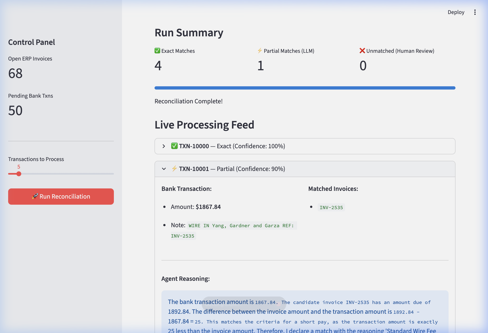

# Agent Ledger

> **AI powered B2B payment reconciliation using a multi-agent LangGraph pipeline.**

AgentLedger matches messy, real world bank statements against strict ERP Accounts Receivable data. It handles the edge cases that make reconciliation painful for compliance and other stakeholders:

| Edge Case | How AgentLedger Handles It |
|---|---|
| **Bulk Payments** | One deposit paying multiple invoices → multi-invoice hypothesis scoring |
| **Short Pays** | Wire fee deductions → amount discrepancy detection with configurable tolerance |
| **Typos & Fuzzy Refs** | Misspelled references → LLM-powered fuzzy matching with confidence scores |

---

## Repository Structure

```
agent-ledger/
├── data/
│   └── generate_mock_data.py    # Synthetic bank and ERP data generator
├── src/
│   ├── agents/
│   │   ├── graph.py             # LangGraph state and workflow definition
│   │   ├── matcher_agent.py     # Core matching logic (LLM with heuristics)
│   │   └── human_in_loop.py     # 'Human in the Loop approval' node
│   ├── tools/
│   │   └── erp_api.py           # ERP lookup tools exposed to agents
│   ├── models/
│   │   └── schemas.py           # Data models
│   └── config.py                # Project configuration
├── requirements.txt
└── README.md
```

## User Interface

AgentLedger includes a real time Streamlit dashboard that visualizes the AI's matching logic, step by step reasoning for partial matches, and *human-in-the-loop* workflows.



---

## Quick Start

```bash
# 1. Clone the repo
git clone https://github.com/<your-org>/agent-ledger.git
cd agent-ledger

# 2. Create a virtual environment
python3.12 -m venv .venv && source .venv/bin/activate

# 3. Install dependencies
pip install -r requirements.txt

# 4. Generate mock data
python data/generate_mock_data.py

# 5. Start the Application Dashboard!
streamlit run app.py
```
## Tech Stack

- **Python 3.12+**
- **LangGraph** – stateful agent orchestration and Human in the Loop workflows
- **Pydantic v2** – strict runtime data validation
- **Pandas** – data ingestion and manipulation

## 📜 License

MIT
